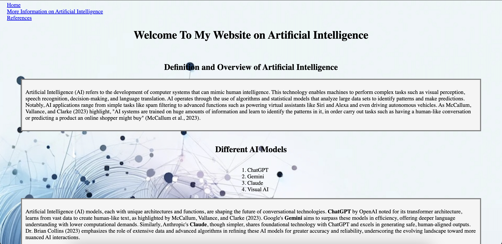

# Webproject

This is a multi-page website I built using HTML and CSS as part of an Information Systems project.  
It explores AI, machine learning, and ethics, while demonstrating basic front-end development skills.

🌐 **Live Demo:** [View the site here](https://spdt918-cell.github.io/webproject/)  
💻 **Code:** [View this repository](https://github.com/spdt918-cell/webproject)

---

## Features
- ✅ Multi-page structure (`index.html`, `secondpage.html`, `references.html`)  
- ✅ Custom CSS styling (`style.css`)  
- ✅ Integrated images and assets for layout & design  

---

## Tech Used
- HTML5 (page structure)  
- CSS3 (styling & layout)  

---

## Preview

